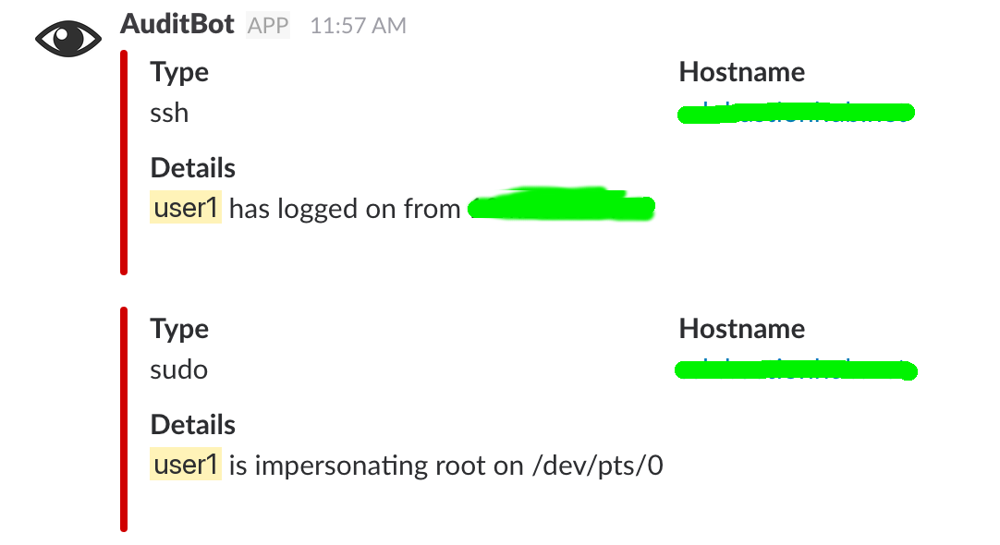
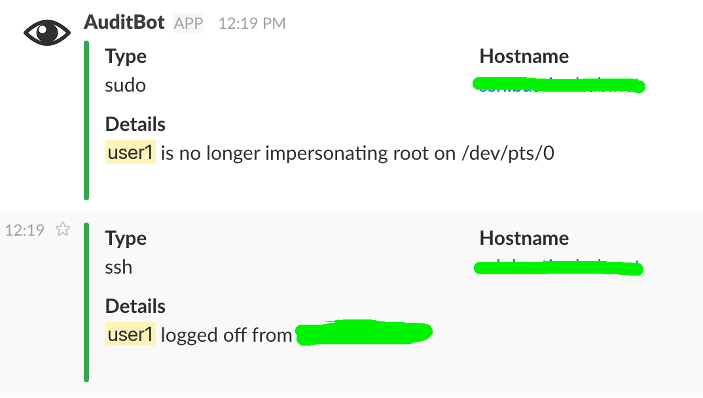

<p align="center">
  <a href="https://github.com/lupaxa-security-toolbox">
    
  </a>
</p>

<h1 align="center">User Notifier</h1>

PAM hooks that tell you when someone logs in or escalates privileges.
A small dispatcher then fans each event out to drop-in hooks. Slack is
the first hook.

You need Linux with PAM (`pam_exec.so`), Python 3.10 or newer (standard
library only), and root on the machine you are wiring up. The default
hook also needs a Slack incoming webhook.

## Install

From the repo root (as root, for a live machine):

```bash
sudo ./scripts/install.sh
```

The script copies the wrappers to `/usr/sbin`, the shared library to
`/usr/lib/user-notifier`, and hooks plus config to
`/etc/user-notifier`. It does not edit PAM.

Edit `/etc/user-notifier/notifier.conf` and set the Slack webhook URL
(and optionally `channel` / `username`). Defaults are channel `audit`
and username `AuditBot`. The installer writes that file at mode `0640`
and will not overwrite an existing live file.

```ini
[notify]
hooks_dir = /etc/user-notifier/hooks.d

[slack]
webhook_url =
channel = audit
username = AuditBot
```

`hooks_dir` is shared. The Slack keys are only required for `50-slack`.

Then add these lines (or merge them into the existing files):

```text
/etc/pam.d/su: session optional pam_exec.so seteuid /usr/sbin/escalation
/etc/pam.d/sudo: session optional pam_exec.so seteuid /usr/sbin/escalation

/etc/pam.d/login: session optional pam_exec.so /usr/sbin/connection
/etc/pam.d/sshd: session optional pam_exec.so /usr/sbin/connection
```

If you place your scripts in a different location then make sure you
update the path in the lines above.

`session optional` means a notify failure never blocks login or sudo.
Notify is synchronous; a slow webhook can delay login or sudo (it still
cannot fail the session).

After PAM is wired, open an SSH session or run `sudo -s`. Slack should
show Type, Hostname, and Details. Closing the session sends a green
follow-up.

## How it Works

-   `/usr/sbin/connection` handles local `login` and `sshd` sessions.
-   `/usr/sbin/escalation` handles `su` and `sudo`.
-   Both source `/usr/lib/user-notifier/pam-common.sh` and call
    `/usr/sbin/user-notify` with type, hostname, details, and state
    (`open` or `close`).
-   Same-user `sudo` to root is skipped. An empty `PAM_RUSER` is actor
    `unknown`.
-   `user-notify` runs every executable in `hooks_dir` in name order and
    continues if one fails. A classified event always exits `0`.
-   Do not write to the login TTY from a hook. Use
    `logger -t user-notifier` if you need logs.

Open sessions are red in Slack (`danger`); close sessions are green
(`good`).





## Hooks

Drop an executable in `/etc/user-notifier/hooks.d/` and `chmod +x`.
Use `NN-name` so order is obvious. `50-slack` is installed by default.
Skipped names: `README*`, `*.example`, and anything starting with `.`.

The same four fields are exported and passed as argv:

| Variable            | Meaning                                              |
| ------------------- | ---------------------------------------------------- |
| `NOTIFY_TYPE`       | `ssh`, `sudo`, `su`, `local login`, `Abnormality`, … |
| `NOTIFY_HOST`       | hostname                                             |
| `NOTIFY_DETAILS`    | human sentence                                       |
| `NOTIFY_STATE`      | `open` or `close`                                    |
| `NOTIFY_COLOR`      | `danger` (open) or `good` (close)                    |
| `SLACK_WEBHOOK_URL` | from `notifier.conf`                                 |
| `SLACK_CHANNEL`     | from config (default `audit`)                        |
| `SLACK_USERNAME`    | from config (default `AuditBot`)                     |
| `NOTIFY_HOOKS_DIR`  | the hooks directory                                  |

Exit non-zero to signal failure. Other hooks still run. The same
contract is installed as `/etc/user-notifier/hooks.d/README`.

Syslog (`40-syslog`):

```bash
#!/bin/sh
logger -t user-notifier -- "${NOTIFY_TYPE} ${NOTIFY_STATE} ${NOTIFY_HOST} ${NOTIFY_DETAILS}"
```

Mail root (`60-mail`; needs a local `mail` command):

```bash
#!/bin/sh
printf '%s\n' "${NOTIFY_DETAILS}" \
  | mail -s "user-notifier ${NOTIFY_TYPE} ${NOTIFY_STATE} on ${NOTIFY_HOST}" root
```

Escalations only (`30-sudo-only`):

```bash
#!/bin/sh
case "${NOTIFY_TYPE}" in
  sudo|su) ;;
  *) exit 0 ;;
esac
logger -t user-notifier -- "${NOTIFY_TYPE} ${NOTIFY_STATE} ${NOTIFY_DETAILS}"
```

`50-slack` reads `SLACK_WEBHOOK_URL`. For a second channel, put that
URL in its own `0640` file and post from a separate hook. Do not commit
the URL.

## Dry-Run

Run a wrapper without PAM. `NOTIFY_TEST_HOSTNAME` keeps the hostname
fixed:

```bash
export USER_NOTIFIER_LIB="$PWD/src/pam-common.sh"
export USER_NOTIFY="$PWD/src/user-notify"
export USER_NOTIFIER_CONFIG="$PWD/config/notifier.conf.example"
export NOTIFY_TEST_HOSTNAME=testhost

PAM_TYPE=open_session PAM_SERVICE=sshd PAM_USER=user1 PAM_RHOST=10.0.0.8 \
  bash src/connection
```

On a live install, leave `USER_NOTIFY`, `USER_NOTIFIER_LIB`, and
`USER_NOTIFIER_CONFIG` unset so `/usr/sbin` and `/etc/user-notifier`
are used. With an empty webhook URL, `50-slack` does nothing.

## Development

```bash
make init
make install-dev
make check
```

<a href="https://github.com/the-lupaxa-project">
    
</a>
