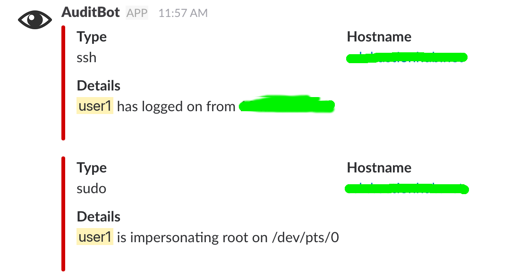
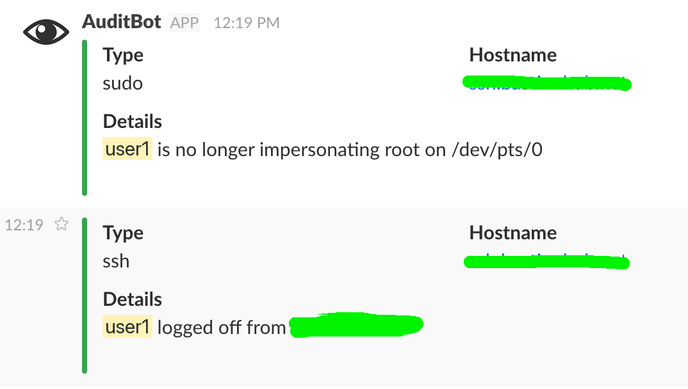

# user-notifier

PAM hooks that tell you when someone logs in or escalates privileges.
A small dispatcher then fans each event out to drop-in hooks. Slack is
the first hook.

`session optional` means a notify failure never blocks login or sudo.
Notify is synchronous: a slow webhook can delay the session, but it
cannot fail it.

## How it fits together

1.   PAM runs `/usr/sbin/connection` (`login`, `sshd`) or
     `/usr/sbin/escalation` (`su`, `sudo`).
2.   Those wrappers classify the event and call `/usr/sbin/user-notify`.
3.   `user-notify` exports `NOTIFY_*` and runs every executable in
     `/etc/user-notifier/hooks.d/`.
4.   `50-slack` is installed by default. Add another script to also mail,
     syslog, or call something else.

Open sessions are red in Slack; close sessions are green.

## Next steps

- [Getting started](getting-started.md) — install, PAM lines, Slack
- [Usage](usage.md) — dispatch, dry-run, and environment overrides
- [Reference](reference.md) — hook contract, config, and paths
- [Examples](examples.md) — syslog, mail, filters, and extra webhooks
